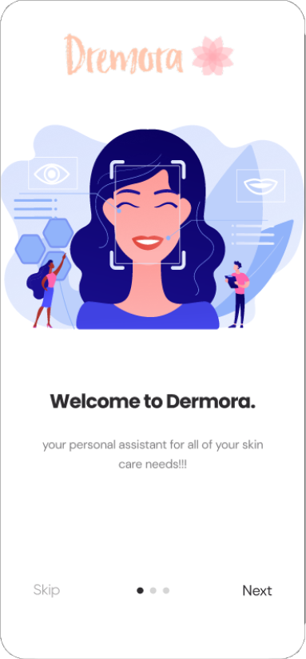
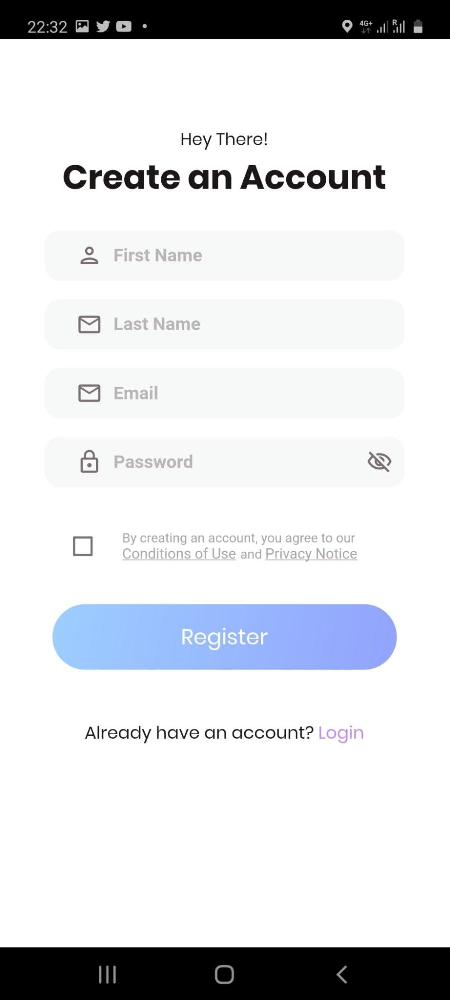
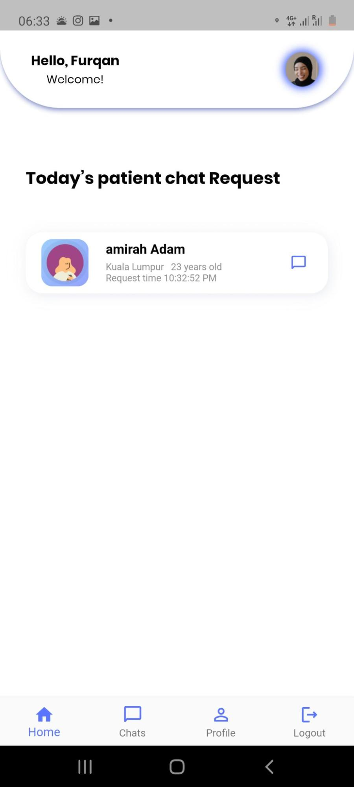
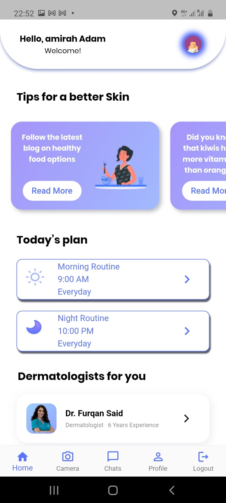
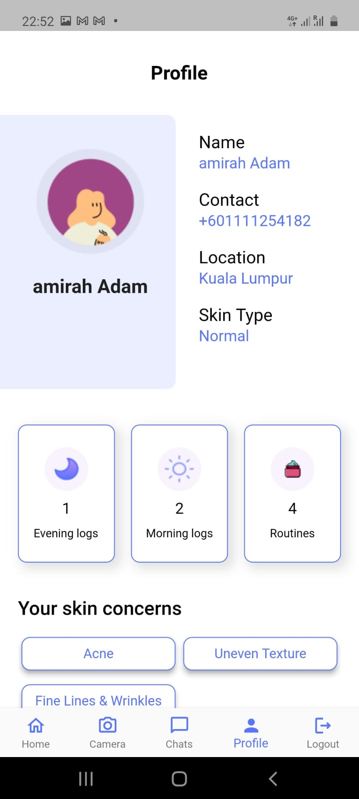
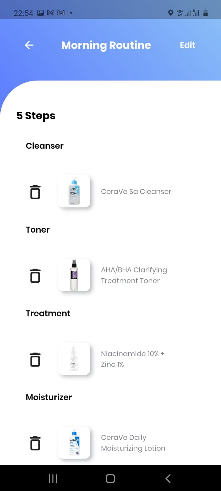
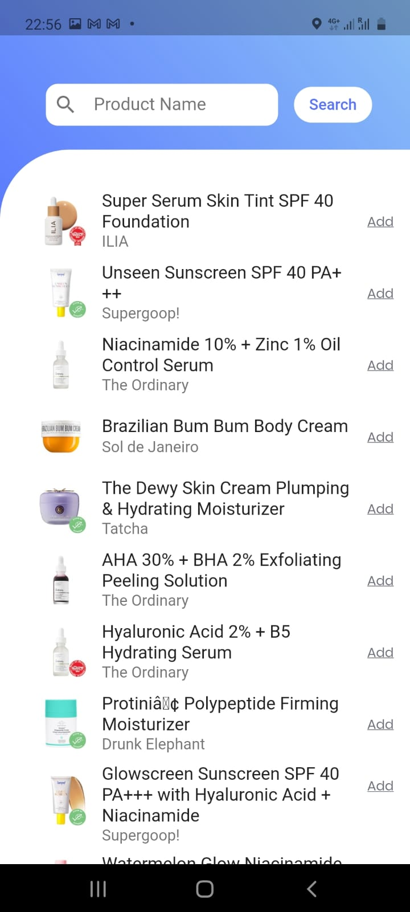
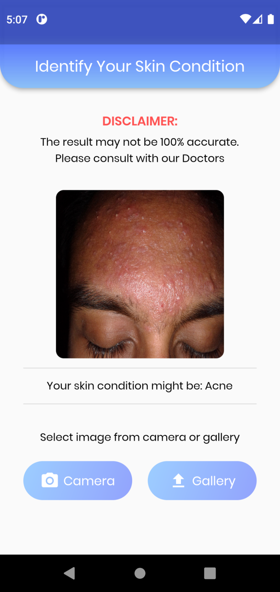
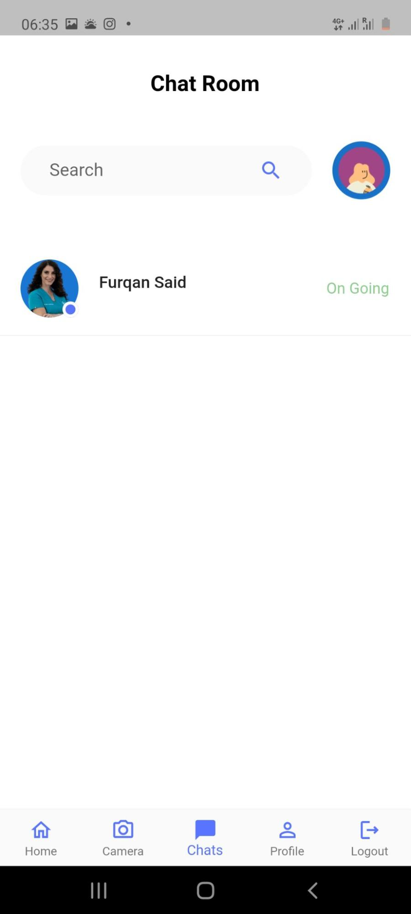

# Dermora
Dermora is a system that will assist users in learning about their skin and getting aware of their skin problems. With the help of Artificial Intelligence and image classification methods.

This mobile application is meant to help its users in following their skincare routines daily while also allowing them to have real-time chats with dermatologists.

## Technologies
---
1) Flutter
2) Node Js (Express Js)
3) MongoDB
4) Socket.io
5) Tensorflow teachable machines

## Scope of Functionalities
---
- The ability to classify Three skin problems (Acne, Eczema, and Psoriasis) using the image classification model created by TensorFlow teachable machines. 
- Users can add and follow their daily skincare. They can find their used product through a simple search since the system uses the Sephora API. 
- Users can start a chat with the dermatologists on the application.

## User Interface
<table>
  <tr>
    <td>Welcome Page</td>
     <td>Sign Up Page</td>
     <td>On Boarding</td>
  </tr>
  <tr>
    <td></td>
    <td></td>
    <td></td>
  </tr>
    <tr>
    <td>Home Page</td>
     <td>Profile Page</td>
     <td>Routine Details Page</td>
  </tr>
  <tr>
    <td></td>
    <td></td>
    <td></td>
  </tr>
  <tr>
    <td>Product Search Page</td>
     <td>Self-Examination Page</td>
     <td>Individual chat Screen</td>
  </tr>
  <tr>
    <td></td>
    <td></td>
    <td></td>
  </tr>
 </table>
 
## Developer Guide
### Flutter Application

1) Make sure flutter is installed on your computer.
2) Make sure to get either a real device connected to the computer OR an Andriod emulator.
3) Check if the device is connected using "flutter Devices". 
4) Clone the repository and navigate to frontenddermora folder. 
5) Run "flutter run"
6) The application will open in your emulator or the real device.

## External Links: 
- https://rapidapi.com/apidojo/api/sephora/pricing
